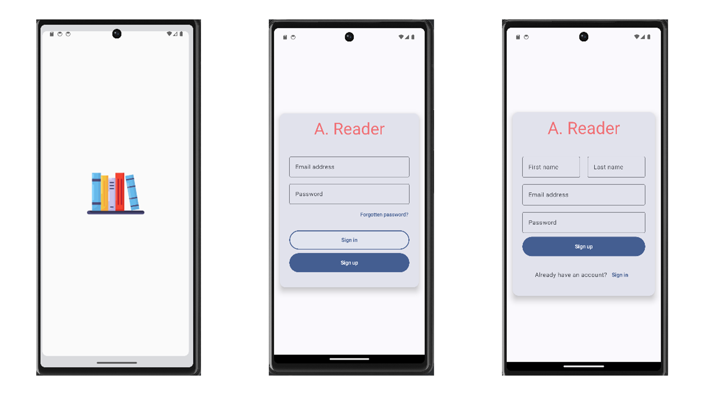
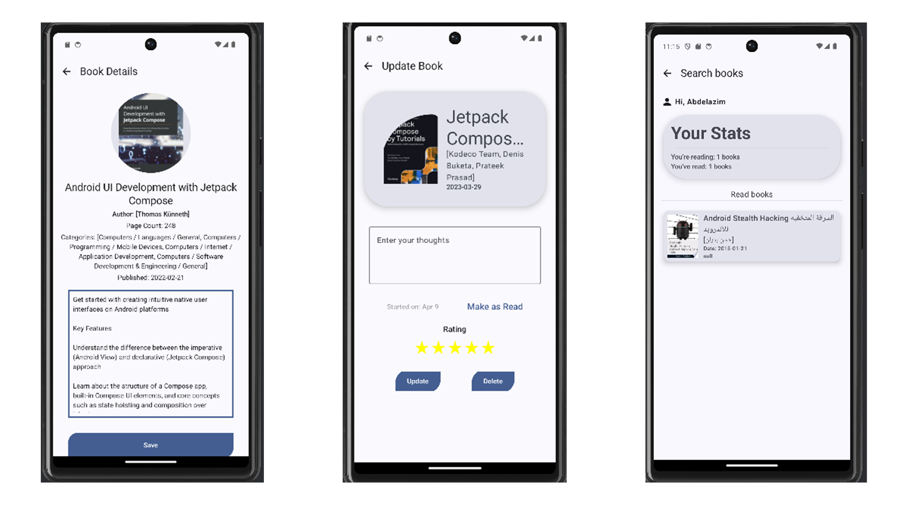

# A.Reader App
A.Reader is a tracking reading books app, built with
[Jetpack Compose](https://developer.android.com/jetpack/compose).
This application helps you to record all the books that you are reading
or that you have finished reading

## Screenshots

  

  

## Features

This ِApp contains three screens:

`Login Screen` to log in or create an account to save your data
on Firebase for easy reference again  `Home Screen` it contains a list of archived books and books that you are currently reading   
`Search Screen` through which you search for books using Google Books Library  
`Details Screen` To read all the details related to the book and save the book to start reading it later  
`Update Screen` To evaluate and add a comment on the book and update its status such as start reading or end reading  
`State Screen` View a list of books that you have already finished reading and their number 

## Main Features

* MVVM
* Kotlin
* Jetpack Compose
* Kotlin Corotines
* REST API
* Retrofit2
* Hilt

